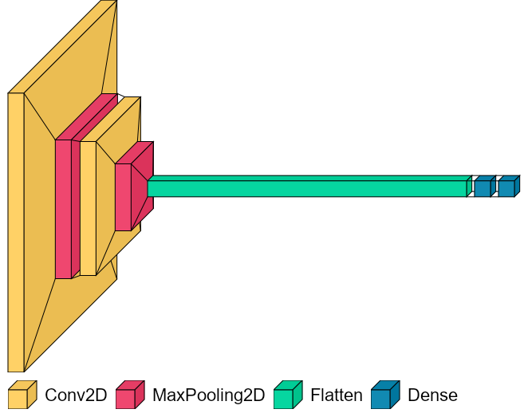

# Glaucoma Detection Using Convolutional Neural Networks
run streamlit directly [here](https://share.streamlit.io/lacharya/glaucoma_detection/main/main.py)

## Contents
1. [**Introduction**](#introduction)
    - [What is Glaucoma?](#what-is-glaucoma?)
    - [The need for affordable imaging and screening](#problem-statement)
    - [Neural Network Model](#model)
2. [ **How to use this repository**](#how-to)
    - [Repository Contents](#rep-contents)
    - [Instructions to run streamlit from local machine](#streamlit)
3. [**References**](#ref)

## Introduction

#### What is Glaucoma?
Glaucoma is a disease of the eye which causes the loss of nerve fibers that carry visual information from the eye to the brain causing a permanent, and irreversible loss of vision. The loss of nerve fibers occurs so slowly that it is generally asymptomatic until a significant amount of vision is lost. The only treatment currently available is to slow the progress of the disease further by reducing the pressure that the fluid naturally contained inside the eye exterts on the retina. This makes it critical that the disease is caught early and treatment begun before any loss of vision occurs.

#### The need for affordable imaging and screening

Glaucoma progresses very slowly, taking 10-15 years, on average, to achieve total blindness. As a result, it is asymptomatic in the early stages and cango unnoticed for years. Patients who seek out medical care for glaucoma on their own without any prior screening only do so after noticable vision loss has already occured. This makes it critical to screen for glaucoma as part of a standard eye exam. Currently screening is done by a trained professional who visually examines the inside of the eye using a photograph or opthalmoscope to identify any abnormal anatomical structures, including nerve fiber loss due to glaucoma. 
    
However, access to a trained professional, or expensive machines to take photographs of the internal structures of the eye is limited in rural or underserved areas, especially in poorer parts of the world. A combination of an inexpensive imaging device and a reliable predictive model dispersed across these areas with a technician trained to use them would hugely benefit communities and provide necessary preventative care to slow down the progress of the disease and preserve vision.  
    
Extensive research in these areas has already produced means to take photographs of the internal eye using a smart phone combined with lenses. ([source](https://advanceseng.com/miniaturized-indirect-ophthalmoscopy-foster-smartphone-wide-field-fundus-photography/), [publication](https://www.ncbi.nlm.nih.gov/pmc/articles/PMC4951186/))

Additionally, studies also exist that have focused their research on automating the detection of glaucoma pathology in images of the retina. [Diaz-Pinto et.al](https://biomedical-engineering-online.biomedcentral.com/articles/10.1186/s12938-019-0649-y#Sec2), in particular, use a convolutional neural network to assess images for glaucomatous loss of nerve tissue. 
    
Here, I have described a simple convolutional neural network that I trained on the same dataset as [Diaz-Pinto et.al](https://biomedical-engineering-online.biomedcentral.com/articles/10.1186/s12938-019-0649-y#Sec2). A comparison of the performance metrics of my CNN and the the Diaz-Pinto model are presented below:

Score | Current Model | Diaz-Pinto Model |
------|---------------|------------------|
recall|0.9747|0.9346|
accuracy|0.9362|0.8977|
auc| 0.9309|0.9605|
precision| 0.9167| <NA>

#### Neural Netowrk Model

A Convolutional Neural Network is the most commonly used deep learning model for classification or analyses of images. The network I used is a __Tensorflow Keras Sequential__ model with the following architecture:  
    
Layer | Type | Hyperparameters |
------|------|-------------|
1| Convolution (Conv2D) | `filters`=32, `kernel_size`=(4, 4), `activation`='relu', `input_shape`=(178, 178, 3)
2| Pooling (MaxPooling2D)| `pool_size`=(2,2)
3| Convolution (Conv2D) | `filters`=32, `kernel_size`=(4, 4), `activation`='relu', `input_shape`=(178, 178, 3)
4| Pooling (MaxPooling2D)| `pool_size`=(2,2)
5| Flattening (Flatten)| n/a
6| Dense layer (Dense) | `units`=128, `activation`='relu'
7| Output layer (Dense)| `units`=1, `activation`='sigmoid'
8| Early stop (EarlyStopping)| `patience`=5
    

The model was compiled with a `batch_size` of 256 and trained for 20 `epochs`. The images that the model was trained on were the raw images resized to 178 x 178 pixels. Glaucomatous images were labelled `1` and healthy images were labelled `0`. 
    
A 2D schematic representation of the architecture of the model is presented below, which was created using the [VisualKeras](https://github.com/paulgavrikov/visualkeras) library.

 
    
## How to use this repository

This repository is built to run a [streamlit](https://streamlit.io/) app: `main.py`

     
### Contents of Repository
In this repository you will find: 
1. A `code/` directory with notebooks for EDA, Model Optimization and Model Performance Metrics.
2. A `data/` directory with the images, `.csv` and `.npy` files the streamlit app needs to run. **Important to note**: The full dataset that the model is trained on is not in this repository, but is publicly available and can be downloaded from [here](https://figshare.com/s/c2d31f850af14c5b5232). You *will*  need this dataset to train the model. Once you have it downloaded, unzip it into `data/Images`
3. A `figures/` directory with figures that the streamlit displays. The figures were optained from one or more references mentioned in the references page of the streamlit. 
4. A `Models/` directory with the initial model `model_01/` and the best model, `model_03_auc93/`, both of which are keras models saved using `keras.save()`
5. A `.streamlit/` directory with the template config file for the streamlit app
6. `.gitattributes`, `.gitignore` and repository `README.md` files for the repository itself
7. `main.py` and `helper.py` scripts to run the streamlit
8. An `environment.yml` file with a list of dependencies you will need to install for this streamlit or model to run on your local machine. 

### Instructions to run streamlit from local machine

1. Fork and clone this repository onto your local machine
2. create a new environment using the `environment.yml` file by typing `conda env create -f environment.yml` in your teminal. 
3. Once the environment is created, activate the environment using `conda activate [env_name]`. Also install streamlit using the command `pip install streamlit`.
4. In terminal, navigate using `cd` to the directory that contains the `main.py` file and type `streamlit run main.py`. The app should now open in a browser window. 

### References
1. Anatomy of the Human Eye
    - [Encyclopedia Britannica](https://www.britannica.com/science/human-eye)
    - [Ken Hub, Optic Nerve](https://www.kenhub.com/en/library/anatomy/the-optic-nerve)
2. Pathophysiology of Glaucoma
    - Review paper by [Weinreb et.al](https://www.ncbi.nlm.nih.gov/pmc/articles/PMC4523637)
3. Affordable Solution For Fundus Imaging
    - Publication by [Toslak et.al](https://www.ncbi.nlm.nih.gov/pmc/articles/PMC4951186/)
    - Advances in Engineering [Article](https://advanceseng.com/miniaturized-indirect-ophthalmoscopy-foster-smartphone-wide-field-fundus-photography/)
4. CNNs for Automated Glaucoma Assessment
    - Publication by [Diaz-Pinto et. al](https://biomedical-engineering-online.biomedcentral.com/articles/10.1186/s12938-019-0649-y#Sec2)
5. CNN Visualization
    - [VisualKeras](https://github.com/paulgavrikov/visualkeras) library by Paul Gavrikov.
